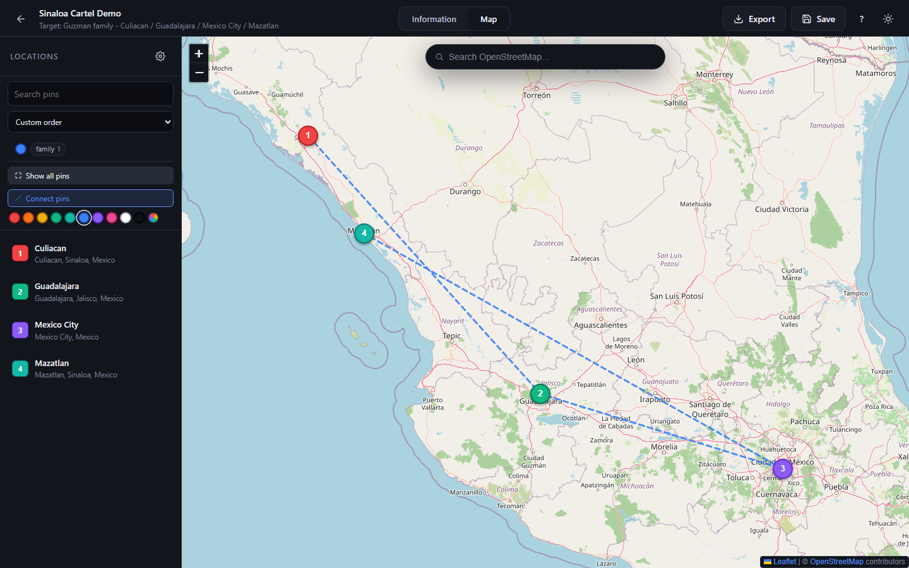
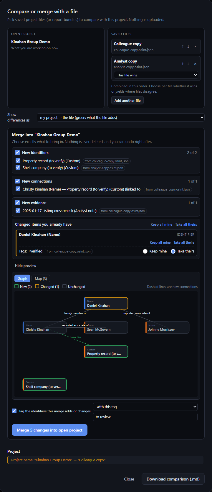
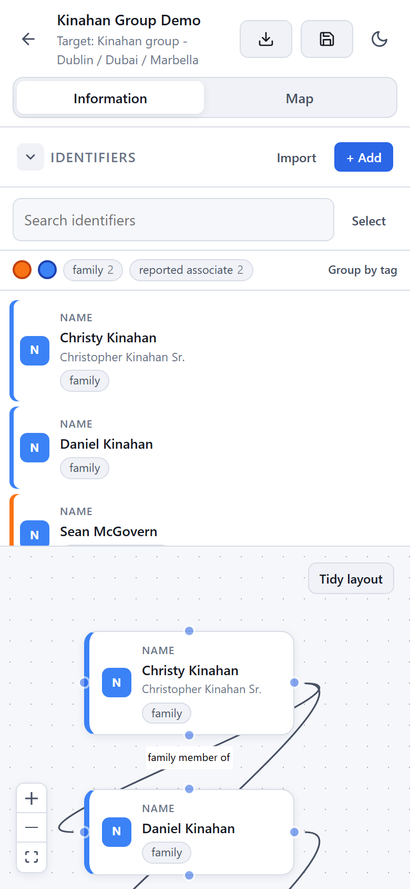

# OSINT Mapping Tool

A local-first OSINT workspace for organizing targets, evidence, and location-based research without sending your data anywhere.

[](https://react.dev)
[](https://vitejs.dev)
[](LICENSE)
[](#privacy-and-storage)
[](https://ko-fi.com/L5F821TQO2)

> Built for research, investigations, and field notes. Everything stays on your machine unless you deliberately choose to export or share a project file.

---

## Overview

OSINT Mapping Tool helps you organize a target into a structured digital case file:

- capture identifiers, contacts, personas, vehicles, and other lead data
- link those records together visually in a graph
- pin places to a map and connect them back to the people or entities tied to them
- store findings in a local project file with notes and evidence trails
- optionally enrich data with public-source lookups and RapidAPI providers

The app is designed to be practical for research work without forcing cloud storage or account creation.

## Why this tool

This project is meant for people who want a clean, private research workspace instead of a bloated social-media dashboard or a locked SaaS product.

- Privacy-first: no backend, no account required, no forced cloud sync
- Portable: save and reopen project files as plain JSON
- Flexible: use Google Maps or OpenStreetMap
- Visual: connect identifiers and places in a way that makes investigation patterns obvious
- Evidence-minded: notes, links, and public-source enrichments are kept with the project

## Screenshots

The demo cases use public-figure, publicly reported information only.

**Start screen** - open, create, or merge projects, with recent projects kept locally.


**Map workspace** - pins with linked identifiers, visited dates, and the shared Locations sidebar.


**Information graph** - identifiers, relationships, tag and colour filters, and evidence.


**A second case study** - the same workspace with a different map and network.



**Public-data enrichment** - optional API lookups saved back as evidence.


**Merge review** - tick exactly what to bring in, see which file each change came from, choose Keep mine / Take theirs per property, and preview the result before committing.



**On a phone** - the same project in the phone-width layout.

<p align="center"></p>

## Available APIs and data sources

The app supports a layered OSINT workflow with both map providers and optional enrichment providers. These are not required for the base app to function, but they can be enabled intentionally when you want stronger public-source context.

### Map providers built into the app

#### Google Maps

- Google Maps JavaScript API and map tiles
- Google Places-style map workflow for richer location context and a familiar map experience
- Best when you want more polished map UX, business context, and address metadata
- Requires a Google Maps API key and optional map ID in local config

#### OpenStreetMap

- OpenStreetMap tiles, Nominatim geocoding, and Overpass place queries
- Fully local-friendly and free to use without a paid API key
- Good for investigations where you want open geographic data, place lookups, and privacy-conscious mapping

### RapidAPI providers supported by the app

These are optional enrichment sources that can be toggled in the app’s external API settings when you provide your own RapidAPI key.

#### Identity and contact intelligence

- People Data Labs — identity resolution and person/profile enrichment using names, emails, and professional signals
- Clearbit — email and company enrichment for business and professional research
- Hunter.io — email discovery and verification for organisations and people
- Numverify — phone validation, line metadata, and country-based number context
- Social Lookup — account and username presence checks across public social surfaces

#### Infrastructure and network intelligence

- SecurityTrails — DNS, hostname, infrastructure, and domain ownership intelligence
- Shodan — exposed devices and internet-facing services
- AbuseIPDB — IP reputation and abuse context
- VirusTotal — malicious URL and domain reputation checks
- ThreatFox — malicious-domain and IOC context for threat and fraud research

#### Geographic and place enrichment

- Geoapify — geocoding, reverse geocoding, and POI enrichment for place-based context
- IP Geolocation — IP-derived geolocation, ASN, ISP, and routing context

### Direct/public data sources supported

These sources are used directly from public endpoints and do not require a RapidAPI subscription in the normal workflow.

- OpenAlex — scholarly works, institutions, and publication-related references
- Wikidata — open structured knowledge graph for people, organisations, events, and networks
- Wikipedia — public reference summaries and narrative context for known entities and events
- OpenCorporates — company and corporate-structure lookups for legal and ownership research
- ThreatFox — public malware IOC and suspicious infrastructure reference data

### Investigation workflow built around those sources

The app is designed to use these sources in a layered, evidence-first way:

- identity checks for people, email addresses, phone numbers, and public profiles
- infrastructure checks for domains, IPs, hosts, and exposed services
- geographic context for places, reverse geocoding, and movement analysis
- public reference lookups to corroborate names, organisations, and entities
- reputation and risk checks for suspicious domains, URLs, and infrastructure

This means the tool works well for both structured, case-building research and exploratory OSINT investigations without forcing a single vendor or centralized backend.

## Features

### Information graph

Create nodes for people, accounts, emails, phones, vehicles, social handles, and any other research artifact.

- start from a blank canvas or a starter template (person, company, vehicle / location)
- drag connections between nodes and double-click a line to label the relationship
- quick-add new nodes from empty space
- get a non-blocking warning when an email, phone number, or handle you add already exists
- import identifiers from a CSV (works with the app's own CSV export; duplicates are skipped and the import is undoable)
- see which identifiers have related evidence and jump straight to it, and save one identifier's details and evidence as its own report (Markdown or print/PDF)
- select several identifiers in the sidebar to duplicate or delete them together (one undo step)
- tag identifiers and give them a colour label; filter the list by tag or colour (non-matching nodes dim on the canvas), group the list by tag, save filters as named views (and export or import them between projects), and tag or colour a whole group at once
- search identifiers, and tidy the layout by connections in one undoable click
- link pins, notes, and context to the relevant identity
- customize icons and colors for each type

### Map workspace

Pin locations with context, notes, and linked identifiers.

- choose Google Maps or OpenStreetMap
- search by location when useful
- add pins with labels, visited date, notes, and people involved
- search pins, and zoom to fit every pin with one click
- filter pins by the tags or colour labels of the identifiers linked to them (non-matching pins dim on the OpenStreetMap map)
- drag pins into a custom order (numbering follows it) or sort the list by visited date or name
- connect pins and identities across your research board

### Public-data enrichment

Optional enrichment tools can help add context from public sources and supported RapidAPI providers while keeping the workflow explicit and user-controlled.

- look up public records when relevant
- add evidence notes and provenance to the project, including manual analyst notes
- filter the evidence list once a case has a few entries, and copy a source link with one click
- export a case report as Markdown or as a styled, self-contained HTML file, or print it / save it as a PDF from the browser, optionally grouped by tag or colour label
- download a self-contained report bundle (`.zip`) and choose what goes in it: the styled report, Markdown, CSVs, a dossier for each identifier with evidence, saved views, and the full project file, all built in your browser
- export identifiers, locations, or evidence as CSV (spreadsheet formula-safe), or identifiers as JSON
- use provider toggles only when you intentionally enable them

### Compare and merge

Bring a colleague's copy, or several files, into a project without losing your own work.

- compare two saved project files (or report bundles) and download the comparison as Markdown
- merge from inside a project, or merge one or more files into any recent project from the start screen
- review item by item: tick exactly which new identifiers, connections, locations, pin links, evidence, and saved views to bring in (items that depend on something you unticked are held back automatically)
- for each changed item choose *Keep mine* or *Take theirs* one property at a time (take a colleague's notes but keep your tags)
- several files are combined in the order shown (reorderable); choose per file whether it wins or yields where files disagree
- every new or changed item shows which file it came from, and the merge history records what each file contributed
- a read-only preview shows how the project will look afterwards, as a graph or with the pins on a small map
- optionally tag every identifier the merge adds or changes, with a tag of your choice or the source file's name
- start-screen merges offer a backup download first; nothing is ever deleted, and a merge can be undone until your next edit
- every merge is recorded in a merge history that also appears in the case report

### Everyday usability

- works on phone-width screens as well as desktop, with a collapsible sidebar so the canvas and map get the room
- drop a saved project file anywhere on the start screen to open it
- matching between files uses ids, or a shared email, phone number, or handle
- report bundles (`.zip`) can be reopened directly with Open Project, drag and drop, or Compare
- a short first-run tour (skippable, and replayable from the `?` shortcuts dialog)
- unsaved-changes indicator on Save, plus a warning before closing the tab
- keyboard shortcuts: `Ctrl/⌘+S` save, `/` search, `Alt+1` / `Alt+2` switch tabs, `?` for the full list

## Getting started

Requirements:

- Node.js 18+
- npm

```bash
git clone https://github.com/hashking710/OSINT-Mapping-Tool.git
cd OSINT-Mapping-Tool
npm install
npm run dev
```

Then open:

<http://localhost:5173>

Build a production bundle:

```bash
npm run build
npm run preview
```

### Docker

```bash
cp .env.example .env          # the Google Maps key is optional
docker compose up             # dev server with hot reload on http://localhost:5173
docker compose -f docker-compose.prod.yml up --build   # production build on http://localhost:4173
```

### Scripts and testing

| Command | What it does |
| --- | --- |
| `npm test` | unit tests (`node --test`) |
| `npm run test:e2e` | Playwright end-to-end tests (first run: `npx playwright install chromium`) |
| `npm run lint` | ESLint |
| `node scripts/generate-readme-demo-assets.mjs` | regenerate the README screenshots (dev server on port 5175) |

The heavier parts of the app (map tabs, merge dialog, report bundle, tour, report builders) are loaded on demand.

## Optional Google Maps setup

If you want the richer Google Maps experience, add your API key in the app settings or in a local config file.

```bash
cp public/app.config.example.json public/app.config.json
```

Then fill in your values:

```json
{
  "googleMaps": {
    "apiKey": "YOUR_KEY_HERE",
    "mapId": "YOUR_MAP_ID"
  }
}
```

The local browser config is preferred, and the file is meant to stay local to your machine.

## Privacy and storage

This project is intentionally local-first:

- project files live on your device
- settings are stored in the browser
- no remote sync is required
- no analytics or backend data collection is built into the app

You are in control of what you save, what you share, and how long you keep it.

## Support the project

If you want to support ongoing development, you can buy a coffee or contribute toward the project’s maintenance and feature work.

[](https://ko-fi.com/L5F821TQO2)

## License

This project is licensed under the GPL-3.0 license.

See [LICENSE](LICENSE) for details.

## Project structure

```text
src/
  components/
    info/      identifier list, rows, filters, bulk bar, evidence panel
    merge/     source pickers, diff results, merge panel, merge history, preview
    project/   top bar, export menu and actions, shortcuts, merge banner
  context/     project state, autosave, merge undo
  hooks/       filters, bulk selection, CSV import, shortcuts, merge sources
  utils/       project IO, merge engine, reports, CSV, ZIP, external APIs
  styles/
  App.jsx
  main.jsx
scripts/       README screenshot generator
test/          unit tests
e2e/           Playwright tests
docker/        production server and entrypoints
public/
  app.config.example.json
readme_images/ screenshots (Example1-7)
```
