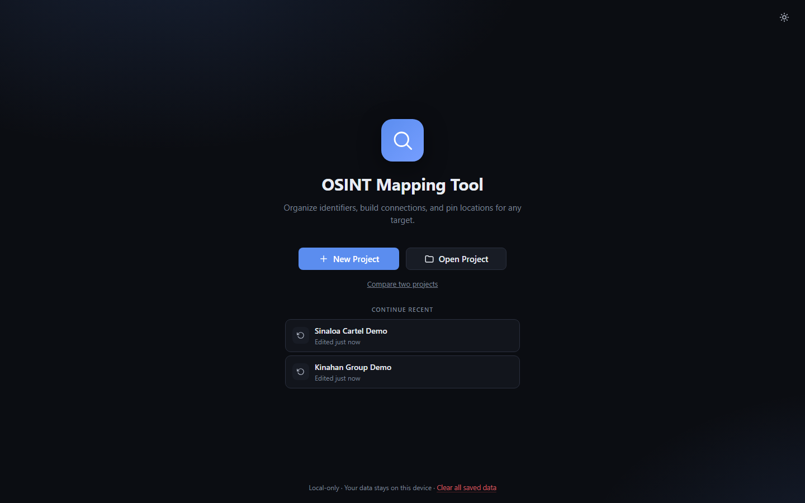
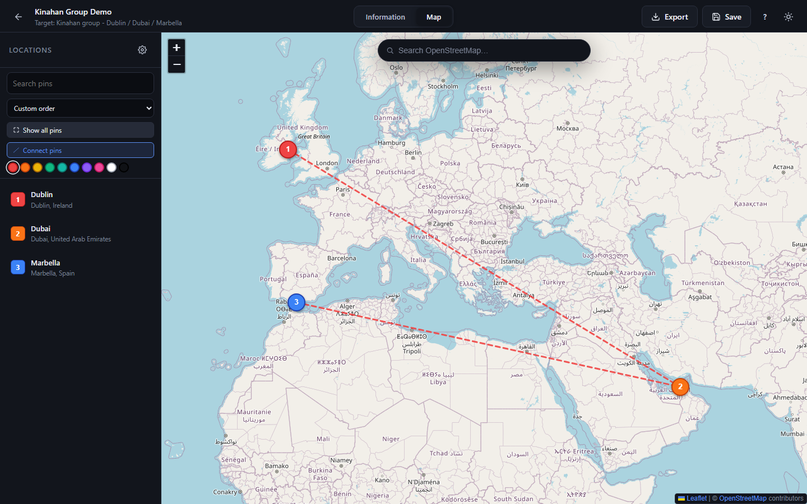

<div align="center">

# OSINT Mapping Tool

A local-first OSINT workspace for organizing targets, evidence, and location-based research without sending your data anywhere.

[](https://react.dev)
[](https://vitejs.dev)
[](LICENSE)
[](#privacy)
[](https://ko-fi.com/hashking)

</div>

> Built for research, investigations, and field notes. Everything stays on your machine unless you deliberately choose to export or share a project file.

---

## Overview

OSINT Mapping Tool helps you organize a target into a structured digital case file:

- capture identifiers, contacts, personas, vehicles, and other lead data
- link those records together visually in a graph
- pin places to a map and connect them back to the people or entities tied to them
- store findings in a local project file with notes and evidence trails
- optionally enrich data with public-source lookups and RapidAPI providers

The app is designed to be practical for research work without forcing cloud storage or account creation.

## Why this tool

This project is meant for people who want a clean, private research workspace instead of a bloated social-media dashboard or a locked SaaS product.

- Privacy-first: no backend, no account required, no forced cloud sync
- Portable: save and reopen project files as plain JSON
- Flexible: use Google Maps or OpenStreetMap
- Visual: connect identifiers and places in a way that makes investigation patterns obvious
- Evidence-minded: notes, links, and public-source enrichments are kept with the project

## Screenshots

<div align="center">





</div>

## Features

### Information graph

Create nodes for people, accounts, emails, phones, vehicles, social handles, and any other research artifact.

- drag connections between nodes
- quick-add new nodes from empty space
- link pins, notes, and context to the relevant identity
- customize icons and colors for each type

### Map workspace

Pin locations with context, notes, and linked identifiers.

- choose Google Maps or OpenStreetMap
- search by location when useful
- add pins with labels, visited date, notes, and people involved
- connect pins and identities across your research board

### Public-data enrichment

Optional enrichment tools can help add context from public sources and supported RapidAPI providers while keeping the workflow explicit and user-controlled.

- look up public records when relevant
- add evidence notes and provenance to the project
- use provider toggles only when you intentionally enable them

## Getting started

Requirements:

- Node.js 18+
- npm

```bash
git clone https://github.com/hashking710/OSINT-Mapping-Tool.git
cd OSINT-Mapping-Tool
npm install
npm run dev
```

Then open:

- http://localhost:5173

Build a production bundle:

```bash
npm run build
npm run preview
```

## Optional Google Maps setup

If you want the richer Google Maps experience, add your API key in the app settings or in a local config file.

```bash
cp public/app.config.example.json public/app.config.json
```

Then fill in your values:

```json
{
  "googleMaps": {
    "apiKey": "YOUR_KEY_HERE",
    "mapId": "YOUR_MAP_ID"
  }
}
```

The local browser config is preferred, and the file is meant to stay local to your machine.

## Privacy and storage

This project is intentionally local-first:

- project files live on your device
- settings are stored in the browser
- no remote sync is required
- no analytics or backend data collection is built into the app

You are in control of what you save, what you share, and how long you keep it.

## Support the project

If you want to support ongoing development, you can buy a coffee or contribute toward the project’s maintenance and feature work.

- Ko-fi: https://ko-fi.com/hashking

## License

This project is licensed under the GPL-3.0 license.

See [LICENSE](LICENSE) for details.

## Project structure

```text
src/
  components/
  context/
  styles/
  utils/
  App.jsx
  main.jsx
public/
  app.config.example.json
readme_images/
  Example1.png
  Example2.png
```
